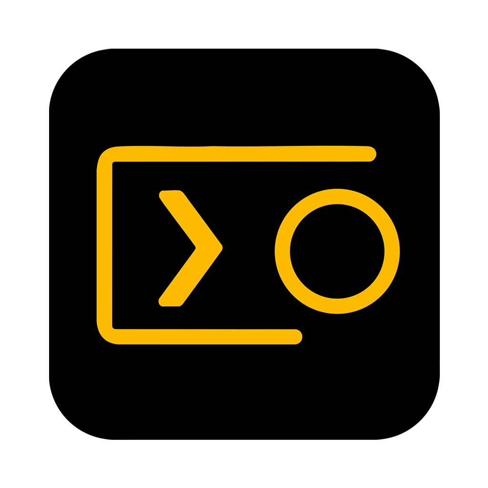
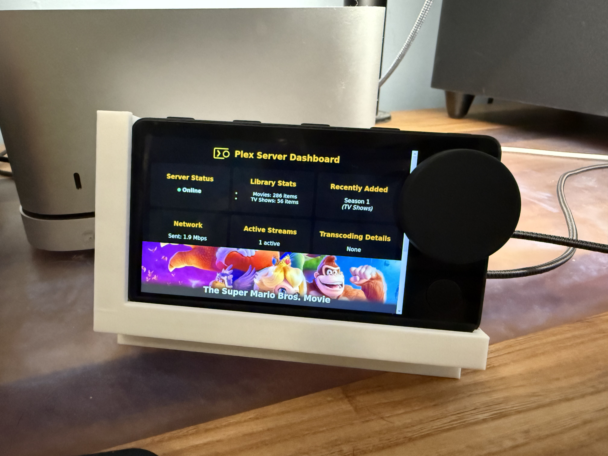

# PlexThing

  

  

A custom dashboard interface for Plex, built for the discontinued Spotify Car Thing. This project lets you repurpose your Car Thing to display real-time Plex server activity including library stats, active streams, and more.

---

## Flashing the Car Thing

To use PlexThing on your Car Thing, you'll first need to flash it with custom firmware using **[Terbium](https://terbium.app/)**.

### Recommended Firmware:
Use the **No-RNDIS firmware build**, which works more reliably with the Helper App.

🔗 [No-RNDIS Image for Terbium](https://thingify.tools/firmware/P3QZbZIDWnp5m_azQFQqP/Sn_vBLpPfJjic6DZtCj6k)

> You must use the Terbium web app (or CLI) to flash this image. For a step-by-step guide, visit [terbium.app](https://terbium.app).

Once flashed, the Car Thing will boot into a simple webapp-based UI. This is where PlexThing's frontend will be deployed via the Helper App.

---

##  Getting Your Plex Server Details

To get started, you need your **local Plex server IP** and **authentication token**.

###  Finding Your Plex Server Local IP (Easiest Method)

1. Open [Plex Web](https://app.plex.tv) in your browser and sign in.
2. In the sidebar, go to **Settings** → **Remote Access**.
3. Look for the line that says:

   > **Fully accessible outside your network**  
   > `Your server is mapped to http://192.168.x.x:32400`

4. That `http://192.168.x.x:32400` is your **local Plex IP and port**.

>  This is the address you'll enter into the PlexThing Helper App.

###  How to Find Your Plex Token

1. Open [Plex Web](https://app.plex.tv/desktop) and sign in.
2. Browse to any item in your library (movie, show, etc.).
3. Click the **three dots** (`⋯`) on the item and choose **Get Info**.
4. In the info window, click **View XML** at the top right.
5. A new browser tab will open. Look at the URL — you'll see `X-Plex-Token=YOUR_TOKEN_HERE`.

Copy that token and paste it into the Helper App when prompted.

---

Once you have the IP and Token, launch the **PlexThing Helper App**, enter the details, and click **Connect to Plex**. From there, you can push the build to the Car Thing and start monitoring your Plex server!

---

## 🛠 Want to Contribute?

Feel free to fork, explore, and submit pull requests — just don’t sell derivatives.

Licensed under [Creative Commons Non-Commercial](https://creativecommons.org/licenses/by-nc/4.0/).
